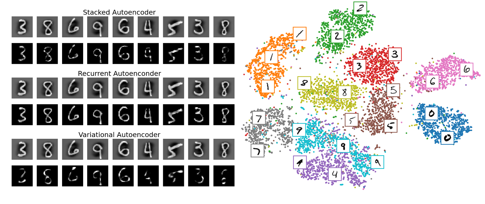

# Studies with Autoencoder models

## Clustering using Autoencoder and t-SNE

Studies that use autoencoders to reconstruct handwritten digits from MNIST and t-SNE to help visualize this dataset.

- Jupyter Notebook: <a href="Clustering using Autoencoder and t-SNE.ipynb">click here</a>.

- Summary of Jupyter Notebook:
  - Initial setups and check GPU
  - Dataset
  - Training Autoencoders
  - Learning curves 
  - Reconstructions with autoencoders
  - Dimensionality reduction
  - Next steps
  - References

 

    

 
